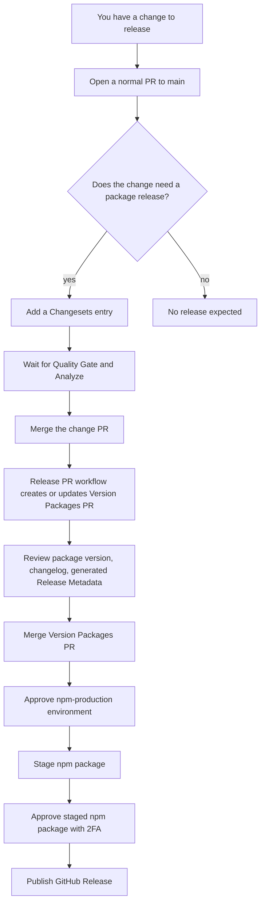

# Skopeo Release Pipeline Runbook

Last verified: 2026-05-22

This runbook is for humans and agents preparing, staging, and completing a release of `@skopeo/cli`.

## Release Model

Skopeo has one public release artifact:

- npm package: `@skopeo/cli`
- CLI binary: `skopeo`
- Git tag pattern: `skopeo-cli-vX.Y.Z`
- GitHub environment: `npm-production`

Internal workspace packages are private and are bundled into the CLI. Do not try to publish them separately.

There are two deployment routes:

- Normal route: merge a changeset-bearing change, let the automated release PR bump the version, merge that release PR, then approve npm staging.
- Manual dispatch route: run `Release PR` or `Stage npm Release` manually from GitHub Actions when recovering or re-running the same automation.

There is no separate app, server, container, or infrastructure deployment pipeline in this repository.

## Normal Release Route



### 1. Prepare The Change

Create a normal pull request into `main`.

If the change should be released to npm, add a changeset:

```sh
bun run changeset
```

Choose the appropriate semver bump for `@skopeo/cli`. The Changesets configuration ignores private internal packages:

- `@skopeo/biome-config`
- `@skopeo/config`
- `@skopeo/typescript-config`

Before handing off the PR, run the local required checks:

```sh
bun run format
bun run check-types
bun run lint
bun run test
```

The repository CI uses `bun run format:check`, not `bun run format`, so local formatting should be committed before the PR is ready.

### 2. Merge The Change PR

Wait for the required GitHub checks:

- `Quality Gate`
- `Analyze`

After the PR merges to `main`, these workflows run on the `main` push:

- `CI`
- `CodeQL`
- `Release PR`
- `Stage npm Release`

For a normal feature PR, the first `Stage npm Release` run usually skips because the current `apps/cli/package.json` version already exists on npm.

### 3. Review The Release PR

The `Release PR` workflow creates or updates a branch named:

```text
changeset-release/main
```

It creates or updates a pull request titled:

```text
Version Packages
```

Review this PR for:

- Expected `apps/cli/package.json` version
- Expected `apps/cli/CHANGELOG.md` entry
- Expected generated CLI Release Metadata in `apps/cli/src/version.generated.ts`
- No unrelated source changes

If the release PR branch exists but no PR was created, GitHub likely blocked the token from creating pull requests. Open the PR manually from `changeset-release/main` to `main`, or configure `RELEASE_PR_TOKEN` / repository workflow PR creation permissions.

### 4. Merge The Release PR

After `Quality Gate` and `Analyze` pass on the release PR, merge it to `main`.

This `main` push is the one that should stage the new npm version. The `Stage npm Release` workflow will wait at the `npm-production` environment gate before running its release steps.

### 5. Approve The GitHub Environment

In GitHub Actions, open the waiting `Stage npm Release` run and approve the `npm-production` deployment.

Confirmed environment rules:

- Required reviewer: `endalk200`
- Admin bypass: disabled
- Allowed deployment branch: `main`

Do not approve if:

- The run is not from `main`
- The version was not expected
- Required PR checks failed or were bypassed
- The release PR contains unexpected files

### 6. Wait For Staging

After approval, the workflow should run:

1. Release dependency audit
2. Format check
3. Type check
4. Lint
5. Tests
6. Build
7. npm package verification
8. Packed-package smoke test
9. npm version existence check
10. `npm stage publish --access public --tag latest --provenance`
11. Release tag creation
12. Draft GitHub Release creation or update

If the version already exists on npm, staging is skipped and no new GitHub Release draft is created by that run.

### 7. Approve The Staged npm Package

After the workflow stages the package, complete npm-side approval with the maintainer account and 2FA.

Check before approving:

- Package name is `@skopeo/cli`
- Version matches the release PR
- Provenance is present
- Git commit matches the merged release PR commit
- Package contents are expected: `dist/bin.js`, `LICENSE`, `package.json`, `README.md`

After npm approval, the package becomes publicly available under the configured dist-tag, currently `latest`.

### 8. Publish The GitHub Release

The workflow creates or updates a draft release titled:

```text
Skopeo CLI vX.Y.Z
```

Only publish the GitHub Release after npm approval succeeds.

The expected tag is:

```text
skopeo-cli-vX.Y.Z
```

Release tags matching `skopeo-cli-v*` are protected by a GitHub ruleset that blocks deletion and non-fast-forward updates.

## Manual Dispatch Route

Use manual dispatch for recovery, not as the default release path.

### Re-run Release PR Creation

Run the `Release PR` workflow manually when:

- A changeset exists on `main`, but no release PR was created
- The release PR branch needs to be regenerated
- The previous release PR run was blocked by token permissions

Expected result:

- Existing release PR is updated, or
- `changeset-release/main` is pushed and a warning explains how to open the PR manually, or
- No changes are found and the workflow exits without a PR update

### Re-run npm Staging

Run the `Stage npm Release` workflow manually when:

- A versioned release PR already landed on `main`
- The staging workflow failed for an environmental reason
- The npm package version does not already exist

Expected result:

- The workflow waits for `npm-production` approval
- The release checks run
- If the version is unpublished, npm staging runs
- If the version already exists, the workflow exits successfully with staging skipped

Do not use manual dispatch to stage an arbitrary local branch. The environment allows branch `main`, and the workflow is designed around the version currently on `main`.

## Agent Instructions

When an agent is asked to prepare a release-bound change:

1. Inspect `CONTEXT.md` for terminology.
2. Make the requested code changes.
3. If the change affects the released CLI behavior, add a changeset for `@skopeo/cli`.
4. Run:

```sh
bun run format
bun run check-types
bun run lint
bun run test
```

5. Report whether a changeset was added.
6. Do not manually edit version numbers unless explicitly handling the generated release PR path.
7. Do not publish to npm locally.
8. Do not create or move `skopeo-cli-v*` tags locally.
9. Do not bypass the `npm-production` environment.
10. Do not publish the GitHub Release before npm-side staged-package approval.

When an agent is asked to inspect a release:

1. Verify `apps/cli/package.json` version.
2. Verify `apps/cli/src/version.generated.ts` matches the package version.
3. Verify the release PR only contains expected versioning/changelog/generated metadata changes.
4. Verify `Quality Gate` and `Analyze` passed.
5. Verify the `Stage npm Release` run is from `main`.
6. Verify npm shows the released version after staged approval.
7. Verify tag `skopeo-cli-vX.Y.Z` points at the release commit.

## Failure Modes

### Release PR Was Not Created

Likely causes:

- No changesets exist on `main`
- GitHub Actions token is not allowed to create PRs
- `RELEASE_PR_TOKEN` is missing or lacks needed permissions

What to do:

1. Check the `Release PR` workflow logs.
2. If it says no changesets were found, no release PR is needed.
3. If it pushed `changeset-release/main` but could not create a PR, open the PR manually.
4. If token permissions are the issue, configure `RELEASE_PR_TOKEN` or enable the repository setting that allows GitHub Actions to create pull requests.

### Stage npm Release Is Waiting

Likely cause:

- The `npm-production` environment requires approval.

What to do:

1. Confirm the run is from branch `main`.
2. Confirm the version is expected.
3. Confirm the release PR was reviewed.
4. Approve the environment deployment as `endalk200`.

### Staging Skipped

Likely cause:

- The version already exists on npm.

What to do:

1. Confirm `apps/cli/package.json` version.
2. Check npm for `@skopeo/cli@VERSION`.
3. If already published, do not try to republish the same version.
4. If a new release is needed, create a new changeset and release a new version.

### Release Audit Failed

Likely cause:

- `bun audit --audit-level=moderate` found a moderate, high, or critical advisory.

What to do:

1. Read the advisory in the workflow logs.
2. Upgrade or override the affected dependency where appropriate.
3. If accepting risk, document the decision explicitly before retrying. The current release script treats moderate-or-higher advisories as blocking.

### Package Verification Failed

Likely causes:

- `@skopeo/cli` is marked private
- Runtime dependency fields were added
- The packed file list changed
- Packed version differs from `apps/cli/package.json`

What to do:

1. Keep `@skopeo/cli` public.
2. Keep runtime dependencies bundled unless there is an intentional release-design change.
3. If package contents must change, update the verification script and document the reason.

### Smoke Test Failed

Likely causes:

- CLI bundle did not build correctly
- `skopeo version` does not match package version
- `skopeo --version` does not include package version
- `skopeo config path` no longer prints the expected default config path

What to do:

1. Reproduce locally with `bun run release:smoke`.
2. Fix the CLI behavior or update the smoke expectations if the behavior intentionally changed.
3. Re-run the full required local checks.

## Release Checklist

Use this checklist for a normal npm release:

- Change PR includes a changeset when release is intended
- Change PR passed `Quality Gate`
- Change PR passed `Analyze`
- Change PR merged to `main`
- `Version Packages` release PR was created or updated
- Release PR version is correct
- Release PR changelog is correct
- Release PR generated Release Metadata is correct
- Release PR passed `Quality Gate`
- Release PR passed `Analyze`
- Release PR merged to `main`
- `Stage npm Release` run is from `main`
- `npm-production` environment approval was intentional
- Stage job passed release audit, quality checks, build, package verification, and smoke test
- npm package was staged with provenance
- npm staged package was approved with maintainer 2FA
- npm latest version matches expected release
- `skopeo-cli-vX.Y.Z` tag exists and points to the release commit
- GitHub Release was published after npm approval

## Current Baseline

As of 2026-05-22:

- `apps/cli/package.json` version is `0.0.1`
- npm `@skopeo/cli` latest is `0.0.1`
- npm `@skopeo/cli@0.0.1` has provenance metadata
- Git tag `skopeo-cli-v0.0.1` exists
- Public GitHub releases list is empty
- Latest observed successful `Stage npm Release` run completed on 2026-05-22 for commit `7d2ee926be03a67d4aadf7298014b5b70945405f`
