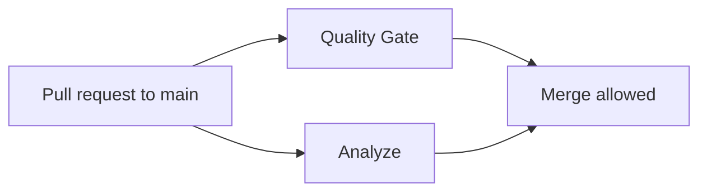
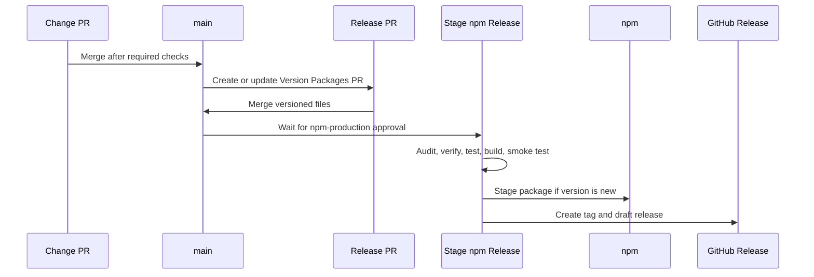

# CI/CD

This document explains how Skopeo checks changes and releases the CLI package.
For release steps, use the release runbook in
`docs/how-tos/release-pipeline.md`.

The Platform API and Web Application use a separate shared Platform Release
lifecycle. See `docs/how-tos/self-host-platform.md` for deployment and artifact
verification.

## What CI Protects

Pull requests into `main` are expected to pass two required checks:

- `Quality Gate`
- `Analyze`

`Quality Gate` comes from `.github/workflows/ci.yml`. It installs dependencies
with Bun `1.3.6`, then runs formatting checks, package boundary validation,
linting, type checks, tests, builds, and native AMD64/ARM64 container smoke and
vulnerability checks.

`Analyze` comes from `.github/workflows/codeql.yml`. It runs CodeQL for
JavaScript and TypeScript.

## What Runs On `main`

A push to `main` starts the same quality checks again and also starts release
automation.

| Workflow | When it runs | What it does |
| --- | --- | --- |
| `CI` | PRs to `main`, pushes to `main`, manual dispatch | Runs the quality gate; successful `main` pushes publish the Platform image pair. |
| `CodeQL` | PRs to `main`, pushes to `main`, manual dispatch, Mondays at 06:30 UTC | Runs code scanning. |
| `Release PR` | Pushes to `main`, manual dispatch | Converts Changesets into a version PR. |
| `Stage npm Release` | Pushes to `main`, manual dispatch | Stages a new `@skopeo/cli` package version on npm. |
| `Dependency Audit` | Manual dispatch, Mondays at 06:00 UTC | Runs `bun audit --audit-level=moderate`. |

Dependabot is configured separately:

- GitHub Actions updates: Mondays at 07:00 UTC
- Bun dependency updates: Tuesdays at 07:00 UTC
- API and Web Dockerfile updates: Wednesdays at 07:00 UTC

## Platform Release Model

`@skopeo/api` and `@skopeo/web` are private workspace packages in one Changesets
fixed group. Their shared SemVer identifies a compatible image pair; it does not
change or constrain the CLI version.

Pull requests build, smoke-test, and scan both final application images on
native AMD64 and ARM64 runners without registry write permission. After every
image variant passes, CI also starts the checked-in Compose bundle and verifies
routing, migration idempotence, and that a failed migration blocks API startup.
On `main`, only after the complete Quality Gate succeeds, a job-scoped publisher rebuilds and scans the
same four variants, pushes them by digest, assembles multi-platform indexes,
creates GitHub attestations, and only then promotes `edge` and the immutable
`sha-<commit>` references for both packages.

When a Changesets release PR changes both application versions, the same run
also creates write-once exact SemVer references, moves stable-only `latest`, and
publishes `skopeo-platform-vX.Y.Z` with both digests and the checksummed Compose
bundle. Permissions are split by responsibility: variant builders receive only
`packages: write`, index promotion receives `packages`, `id-token`, and
`attestations` write access, and the stable GitHub Release job alone receives
`contents: write`.

## Release Model

Skopeo publishes one public package: `@skopeo/cli`. Internal workspace packages
are private implementation details and are not published separately.

Releases use two lanes:

1. `Release PR` turns Changesets into versioned files.
2. `Stage npm Release` stages the versioned package after the release PR lands on
   `main`.

### Release PR

The `Release PR` workflow runs `bun run version-packages`, which executes
Changesets versioning and syncs generated Release Metadata. If that creates
changes, the workflow pushes `changeset-release/main` and creates or updates a
pull request titled `Version Packages`.

The workflow prefers `secrets.RELEASE_PR_TOKEN` when it exists. Otherwise it uses
the default GitHub token. If the token can push the branch but cannot create the
pull request, the workflow prints a manual PR URL.

### Stage npm Release

The `Stage npm Release` workflow is gated by the `npm-production` GitHub
environment. The documented environment policy is:

- reviewer approval is required from `endalk200`
- admin bypass is disabled
- deployments are limited to `main`

After approval, the workflow:

1. installs Node `22.14.0`, npm `11.15.0`, and Bun `1.3.6`
2. installs dependencies with `bun install --frozen-lockfile`
3. runs release audit, format check, type check, lint, tests, and build
4. verifies the npm package contents
5. smoke-tests the packed package in a fresh project
6. reads `apps/cli/package.json`
7. skips successfully if that version already exists on npm
8. otherwise runs `npm stage publish --access public --tag latest --provenance`
9. creates tag `skopeo-cli-vX.Y.Z` and a draft GitHub Release

The package is not public until a maintainer approves the staged package in npm.
The draft GitHub Release should be published only after npm approval succeeds.

## Current Release State

The repository currently records `@skopeo/cli` version `0.0.1` in
`apps/cli/package.json`. npm also reports `@skopeo/cli@0.0.1` as the latest
published version, with provenance metadata.

The release tag format is `skopeo-cli-vX.Y.Z`. Tags matching
`skopeo-cli-v*` are documented as protected from deletion and non-fast-forward
updates.

## Security Notes

The CI/CD design relies on these controls:

- required `Quality Gate` and `Analyze` checks before merging to `main`
- commit-pinned third-party GitHub Actions
- workflow permissions scoped in each workflow file
- no `pull_request_target` workflows
- CodeQL on PRs, pushes, manual dispatch, and weekly schedule
- Dependabot for GitHub Actions and Bun dependencies
- npm publishing through OIDC/provenance instead of a long-lived npm token
- environment approval before npm staging
- package verification and packed-package smoke testing before staging
- protected release tags for `skopeo-cli-v*`

Some repository settings are not stored in this repo, including full branch
protection rules, Actions policy, secret values, environment reviewers, and npm
trusted publishing settings. Verify those settings in GitHub or npm admin views
before changing the release process.
