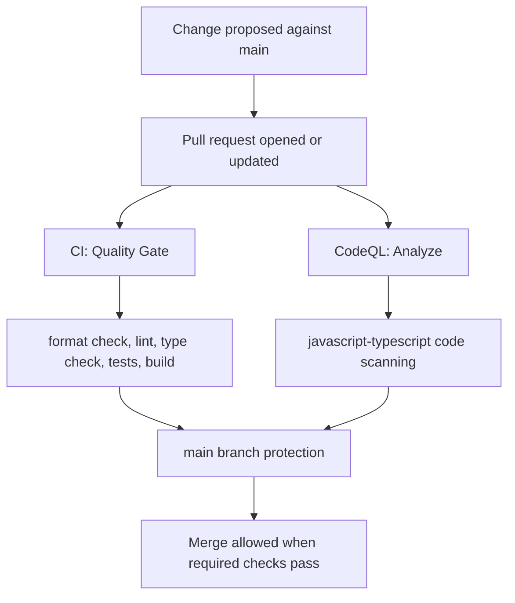
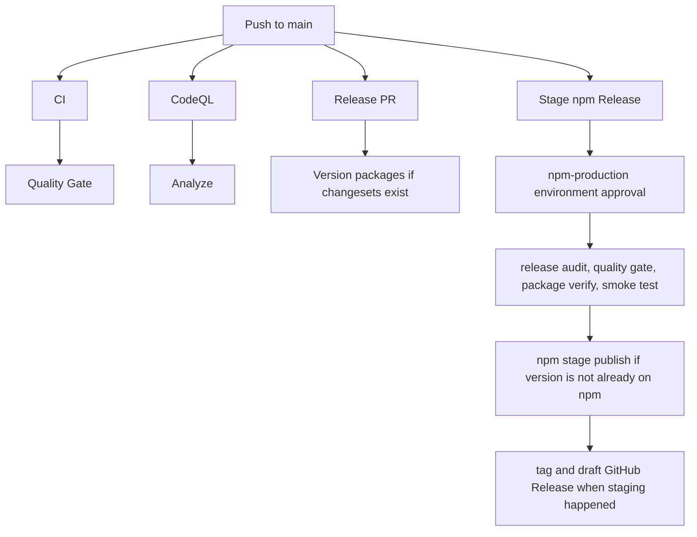
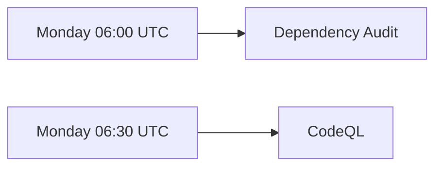
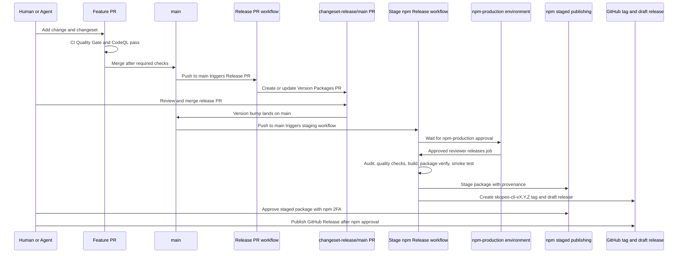

# Skopeo CI/CD Understanding

Last verified: 2026-05-22

This document explains what runs when, how release flow works, how GitHub is configured, and the current security posture. It is intentionally operational rather than implementation-heavy.

## Source Of Truth

Confirmed from repository files:

- `.github/workflows/ci.yml`
- `.github/workflows/codeql.yml`
- `.github/workflows/dependency-audit.yml`
- `.github/workflows/release-pr.yml`
- `.github/workflows/publish-npm.yml`
- `.github/dependabot.yml`
- `.github/CODEOWNERS`
- `.changeset/config.json`
- `package.json`
- `turbo.json`
- `apps/cli/package.json`
- `scripts/audit-release.ts`
- `scripts/verify-npm-package.ts`
- `scripts/smoke-npm-package.ts`
- `docs/adr/0004-github-actions-ci-and-devsecops-gates.md`
- `docs/adr/0005-secure-npm-cli-release-pipeline.md`

Confirmed from public GitHub and npm APIs on 2026-05-22:

- Repository: `endalk200/skopeo`
- Visibility: public
- Default branch: `main`
- `main` is protected
- Required `main` status checks exposed by the public branch API: `Quality Gate` and `Analyze`
- One repository ruleset exists: `Protect skopeo release tags`
- The tag ruleset applies to `refs/tags/skopeo-cli-v*`
- The tag ruleset blocks deletion and non-fast-forward updates
- One environment exists: `npm-production`
- `npm-production` requires reviewer `endalk200`
- `npm-production` does not allow admin bypass
- `npm-production` uses a custom deployment branch policy that allows branch `main`
- `@skopeo/cli` exists on npm, latest is `0.0.1`
- npm `@skopeo/cli@0.0.1` has provenance metadata
- Git tag `skopeo-cli-v0.0.1` exists and points at commit `7d2ee926be03a67d4aadf7298014b5b70945405f`
- Public GitHub releases list is empty; draft releases are not visible through unauthenticated public API

Not fully verifiable without authenticated GitHub admin access:

- Full branch protection settings beyond the public required-check summary
- Repository Actions policy and default `GITHUB_TOKEN` permissions
- Secret names and values, except names referenced by workflow files
- Whether GitHub Actions is allowed to create and approve pull requests at the repository setting level
- Full environment configuration beyond public environment fields
- npm trusted publishing and token-publishing restrictions beyond what the workflow and npm package metadata show

The local `gh` account was configured but had an invalid token at verification time, so admin-only checks were not available through GitHub CLI.

## CI Process

CI has two pull request gates for changes targeting `main`: `CI` and `CodeQL`.

### Pull Request Checks

The `CI` workflow runs on pull requests to `main`, pushes to `main`, and manual dispatch. It runs one job named `Quality Gate` on Ubuntu with Bun `1.3.6`.

Expected `Quality Gate` sequence:

1. Check out the repository
2. Install Bun `1.3.6`
3. Install dependencies with `bun install --frozen-lockfile`
4. Run `bun run format:check`
5. Run `bun run lint`
6. Run `bun run check-types`
7. Run `bun run test`
8. Run `bun run build`

The `CodeQL` workflow runs on pull requests to `main`, pushes to `main`, manual dispatch, and every Monday at 06:30 UTC. It runs one job named `Analyze` for JavaScript and TypeScript code scanning.

The public branch API reports `Quality Gate` and `Analyze` as required checks for `main`.

### Push To Main

Every push to `main` starts a larger set of automation:

The `Stage npm Release` workflow runs on every push to `main`. It does not publish every push. It reads the current `apps/cli/package.json` version and skips staging when that exact version already exists on npm.

### Scheduled Checks

The weekly `Dependency Audit` workflow installs dependencies and runs `bun audit --audit-level=moderate`. It is scheduled/manual only; it is not a pull request required check in the current workflow files.

Dependabot is configured separately:

- GitHub Actions updates: weekly on Monday at 07:00 UTC, grouped as `github-actions`
- Bun dependency updates: weekly on Tuesday at 07:00 UTC, grouped as `bun-dependencies`

## Release Pipeline

Skopeo publishes one public npm package: `@skopeo/cli`. Internal workspace packages are private and are not independently published.

The release system has two automation lanes:

- `Release PR`: turns Changesets into version/package updates
- `Stage npm Release`: stages a versioned npm package after the release PR lands on `main`

### Release PR Lane

Trigger:

- Push to `main`
- Manual workflow dispatch

Permissions:

- `contents: write`
- `pull-requests: write`

Behavior:

- Checks out with `secrets.RELEASE_PR_TOKEN` if present, otherwise `github.token`
- Installs dependencies with frozen Bun lockfile
- Runs `bun run version-packages`, which runs Changesets versioning and synchronizes generated CLI Release Metadata
- If there are version changes, creates or updates branch `changeset-release/main`
- Creates or updates a pull request titled `Version Packages`
- If GitHub blocks PR creation with the token, it still pushes the release branch and emits a warning with the manual PR URL

### Stage npm Release Lane

Trigger:

- Push to `main`
- Manual workflow dispatch

Environment:

- `npm-production`
- Required reviewer: `endalk200`
- Admin bypass disabled
- Custom branch policy allows `main`

Permissions:

- Workflow default: `contents: read`
- Stage job: `contents: read`, `id-token: write`
- Draft GitHub Release job: `contents: write`

Expected staging sequence:

1. Wait for `npm-production` environment approval
2. Check out the repository
3. Install Node `22.14.0`
4. Install npm `11.15.0`
5. Install Bun `1.3.6`
6. Install dependencies with `bun install --frozen-lockfile`
7. Run release dependency audit
8. Run format check
9. Run type check
10. Run lint
11. Run tests
12. Build the CLI package
13. Verify npm package contents
14. Smoke-test the packed npm package in a fresh temp project
15. Read `apps/cli/package.json` version
16. If that version already exists on npm, skip staging
17. Otherwise run `npm stage publish --access public --tag latest --provenance`
18. If staging happened, create tag `skopeo-cli-vX.Y.Z`
19. If staging happened, create or update draft GitHub Release `Skopeo CLI vX.Y.Z`

The latest observed successful staging run was for commit `7d2ee926be03a67d4aadf7298014b5b70945405f` on 2026-05-22. It successfully ran both jobs, staged `@skopeo/cli@0.0.1`, and created tag `skopeo-cli-v0.0.1`. npm reports `0.0.1` as `latest` with provenance metadata.

### Current Release State

- Current package version in `apps/cli/package.json`: `0.0.1`
- npm latest version: `0.0.1`
- Release tag exists: `skopeo-cli-v0.0.1`
- Public GitHub releases list: empty
- A draft GitHub Release may exist because the workflow created one, but unauthenticated API access cannot see draft releases

## GitHub Configuration

### Repository Metadata

- Owner/repo: `endalk200/skopeo`
- Visibility: public
- Default branch: `main`
- Primary language: TypeScript
- Issues enabled: yes
- Projects disabled
- Wiki disabled
- Discussions disabled
- Forking allowed
- Web commit signoff not required
- License: MIT

### Branch Protection

The public branch API confirms that `main` is protected and requires these checks:

- `Quality Gate`
- `Analyze`

The detailed branch protection endpoint requires authentication. The public data does not confirm whether review count, CODEOWNERS review, signed commits, linear history, stale-review dismissal, force-push restrictions, or admin enforcement are enabled for `main`.

### Rulesets

One repository ruleset is active:

- Name: `Protect skopeo release tags`
- Target: tag
- Applies to: `refs/tags/skopeo-cli-v*`
- Enforcement: active
- Rules:
  - Block deletion
  - Block non-fast-forward updates

### Environments

One environment is configured:

- Name: `npm-production`
- Required reviewer: `endalk200`
- Prevent self-review: false
- Admin bypass: disabled
- Deployment branch policy: custom branch policies
- Allowed deployment branch: `main`

This environment gates the `Stage @skopeo/cli` job before the npm staging steps run.

### CODEOWNERS

All files are owned by `@endalk200`. The following release-sensitive paths are explicitly owned:

- `.github/CODEOWNERS`
- `.github/workflows/`
- `.changeset/`
- `apps/cli/package.json`
- `apps/cli/README.md`
- `package.json`
- `bun.lock`
- `scripts/`

CODEOWNERS only enforces review if branch protection requires CODEOWNERS review. That detailed branch-protection setting was not publicly verifiable.

### Workflow Inventory

| Workflow | Trigger | Purpose | Required by public branch API |
| --- | --- | --- | --- |
| `CI` | PR to `main`, push to `main`, manual | Format, lint, type check, test, build | Yes, as `Quality Gate` |
| `CodeQL` | PR to `main`, push to `main`, manual, Monday 06:30 UTC | Code scanning | Yes, as `Analyze` |
| `Dependency Audit` | Manual, Monday 06:00 UTC | Moderate-or-higher dependency audit | No |
| `Release PR` | Push to `main`, manual | Convert changesets into version PR | No |
| `Stage npm Release` | Push to `main`, manual | Stage npm package and draft release | No |
| `Copilot` | Dynamic GitHub workflow | Copilot pull request reviewer | Not represented in repo files |
| `Dependabot Updates` | Dynamic GitHub workflow | Dependabot automation | Not represented as workflow file |

### Secrets And Tokens

Referenced by workflows:

- `RELEASE_PR_TOKEN`, optional, used by `Release PR` to check out, push, and create/update the release PR

No npm token is referenced. The release workflow uses GitHub Actions OIDC via `id-token: write` and `npm stage publish --provenance`, consistent with npm trusted publishing.

Secret existence and npm trust configuration cannot be verified without authenticated admin access to GitHub and npm.

## Security Posture

### Strengths

- `main` is protected and publicly confirms required `Quality Gate` and `Analyze` checks
- Third-party GitHub Actions are pinned by commit SHA
- Workflow permissions are explicitly scoped in workflow files
- No workflow uses `pull_request_target`
- CodeQL runs on PRs, pushes, manual dispatch, and a weekly schedule
- Dependabot covers GitHub Actions and Bun dependencies
- Release staging is separated from release PR creation
- npm staging is gated by the `npm-production` GitHub environment
- `npm-production` requires reviewer approval and disables admin bypass
- npm staging uses OIDC/provenance instead of a long-lived npm token in workflow files
- Release package verification checks the npm tarball file allowlist
- Release smoke testing installs the packed tarball into a fresh project and exercises the `skopeo` command
- The published CLI package is expected to have no runtime npm dependency fields
- Release tags matching `skopeo-cli-v*` are protected against deletion and non-fast-forward updates
- The latest npm release has provenance metadata

### Risks And Gaps

- Full branch protection details were not verifiable without authenticated admin access
- Repository Actions settings and default `GITHUB_TOKEN` permissions were not verifiable without authenticated admin access
- npm trusted publishing restrictions and token-publishing restrictions were not verifiable from public npm metadata
- Dependency Audit is scheduled/manual only; it is not currently a required PR check
- The latest observed `main` commit is unsigned, so signed commits are either not required or not visible as enforced from public data
- `Release PR` has write permissions to contents and pull requests by design; the risk is mitigated by only running on `main` push/manual dispatch, but the optional `RELEASE_PR_TOKEN` must be protected carefully
- `Stage npm Release` runs on every push to `main`; it skips existing versions, but a manually bumped unpublished version on `main` can be staged through the same path
- Draft GitHub Releases are not publicly visible; release completion requires maintainer discipline to publish the GitHub Release only after npm-side approval

## Operational Expectations

For ordinary code changes, expect the pull request to require:

- `Quality Gate`
- `Analyze`

For a merged change to `main`, expect:

- CI and CodeQL to run again
- Release PR automation to check whether version updates are needed
- Stage npm Release to request `npm-production` approval, then skip if the version already exists on npm or stage if the version is new

For a real release, expect:

- A changeset-bearing change to land on `main`
- A `Version Packages` release PR to be created or updated
- The release PR to update package versions and generated Release Metadata
- Merging the release PR to trigger npm staging
- Environment approval before staging
- npm staged-publish approval with 2FA after staging
- GitHub Release publication after npm approval
